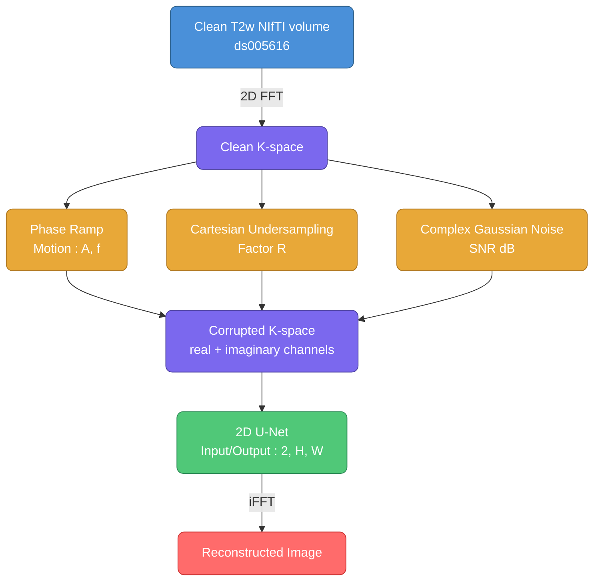

# Deep Learning brathing-induced artifact correction for accelerated MRI

Hi! 

This project was developed during the Brainhack School 2026 at Polytechnique Montréal.

<a href="https://github.com/Annaelle8">
  
  <br /><sub><b>Annaelle8</b></sub>
</a>


---

## Overview

Respiratory motion during MRI acquisition introduces artifacts in k-space that degrade image quality. This is particularly critical for spinal cord imaging. 
This project aim to simulate breathing-induced motion corruption directly in k-space and trains a 2D U-Net to correct these artifacts. Moreover this project aim to simulate accelerated MRI
that's are more and more used because MRI has a long acquisition time, so un undersampling factor is also add in k-space as well as some complex Gaussian noise.


Rather than working in image space, the model operates on **complex k-space data** (real + imaginary channels),
which is more faithful to the actual acquisition process and allows correction before reconstruction.

---

## Scientific Background

During MRI acquisition, k-space lines are acquired sequentially over time. Respiratory motion between acquisitions induces a **phase shift** in each k-space line, modeled as:

$$\tilde{K}(k_x, k_y) = K(k_x, k_y) \cdot e^{-j2\pi k_x \cdot d(k_y)}$$

where $d(k_y)$ is the respiratory displacement at the time of acquisition of line $k_y$.

Combined with **Cartesian undersampling** (acceleration factor R) and **Gaussian noise**, this produces realistic corrupted k-space data used for supervised training.

---

## Pipeline Overview



---
## Repository Structure

```
Sarrazin_project/
│
├── ds005616/                          # Datait)
│
├── src/
│   ├── Kspace_simulation.py           # K-space corruption pipeline
│   ├── Utils.py                       # Metrics and utilities
│   ├── Unet_model.py                  # 2D U-Net architecture
│   └── Unet_train.py                  # Training on)
│
├── notebooks/
│   ├── Kspace_corruption_simulan_vf.ipynb   # Step-by-step simulation
│   ├── Unet_inference.ipynb                    # Inference & visualization
│   └── Unet_analysis.ipynb                   Training curves & metrics
	Gif.ipynb 				# Breathing motion simulation gif
│
├── training_data/
│   ├── mfest_v2.csv                # Dataset manifest (path, TR, TE, H, W, params)
│   └── splits.json                    # Train/val/test subject splits (70/15/15)
│
├── results/
│  ├── unet_best.pt               # Best moint
│  ├── training_history.csv       # Metrics per epoch
│  └─figures_example/           # Generated figures
│
├── train_full.sh                      # SLURM job script (Alliance Canada)
└── README.md
```
# Additional information:

-manifest.csv: one row per (subject × slice × corruption combo) with image path, acquisition parameters (TR, TE), original dimensions (H, W), and corruption parameters (A, f, R, SNR).
-splits.json: Reproducible subject split: 70% train / 15% val / 15% test fixed at random seed 42 -> ensures no data leakage between sets.

---
## Dataset

This project uses the **Whole-Spine Anatomical MRI dataset** (ds005616), available on OpenNeuro:

> [https://openneuro.org/datasets/ds005616/versions/1.1.2](https://openneuro.org/datasets/ds005616/versions/1.1.2)

- **Modality**: T2-weighted sagittal whole-spine MRI
- **Subjects**: 56
- **Resolution**: 1 mm³
- **Format**: NIfTI (.nii.gz), BIDS-compliant

### Data access via Datalad

```bash
datalad install https://github.com/OpenNeuroDatasets/ds005616.git
datalad get sub-*/anat/sub-*_T2w.nii.gz
```
---

### Corruption Parameters

A training dataset was generated my varying the corruption paramters: 

| Parameter | Range | Description |
|---|---|---|
| A | 2.0, 5.0, 8.0 px | Motion amplitude |
| f | 12, 15, 18 breaths/min | Respiratory rate |
| R | 2, 4, 6 | Undersampling factor |
| SNR | 15, 20, 25 dB | Signal-to-noise ratio |

Total combinations: **81 per slice** → 231,417 training samples across 56 subjects.

---

## Model Architecture

**2D U-Net** with 3 pooling levels:

```
Input (2, H, W) — real & imaginary corrupted k-space
    │
    ├── Encoder: 32 → 64 → 128 → 256 (bottleneck)
    │   MaxPool2d between levels
    │
    ├── Decoder: 256 → 128 → 64 → 32
    │   ConvTranspose2d + skip connections
    │
Output (2, H, W) — real & imaginary corrected k-space
```

- **Parameters**: ~1.9M
- **Loss**: L1 (less blurry than MSE)
- **Optimizer**: Adam (lr=1e-3)
- **Scheduler**: ReduceLROnPlateau (patience=5, factor=0.5)
- **Input normalization**: divided by max(|clean k-space|)

---
## Results 


---
## Limitations

- Motion model is **1D rigid translation** only (no rotation, no non-rigid deformation)

---

## Installation & Training

The following set-up use the server Narval on Alliance Canada, you can change it to the server nam who want to use

### 1. Clone the repository

```bash
git clone https://github.com/annaellesarrazin/Sarrazin_project.git
cd Sarrazin_project
```

### 2. Set up the environment

```bash
conda create -n brainhack python=3.10
conda activate brainhack
pip install -r requirements.txt
```

### 3. Download the dataset

```bash
datalad install https://github.com/OpenNeuroDatasets/ds005616.git
cd ds005616
datalad get sub-*/anat/sub-*_T2w.nii.gz
cd ..
```

### 4. Transfer data to Alliance Canada (Narval)

```bash
rsync -av --progress \
    /path/to/Sarrazin_project/ \
    username@narval.alliancecan.ca:/scratch/username/Sarrazin_project/
```

### 5. Set up the environment on Narval

```bash
# Connect to Narval
ssh username@narval.alliancecan.ca

# Load Python module
module load python/3.10

# Create virtual environment
virtualenv ~/brainhack/brainhack
source ~/brainhack/brainhack/bin/activate

# Install dependencies
pip install torch torchvision
pip install -r requirements.txt
```

### 5. Train on Narval

```bash
# Connect to Narval
ssh username@narval.alliancecan.ca

# Go to the folder Sarrazin_project
cd /scratch/username/Sarrazin_project

# Submit the job — environment activation is handled by train_full.sh
sbatch train_full.sh

# Monitor training
squeue -u $USER          # check job status
tail -f logs/unet_*.out  # follow live logs
```

### 6. Retrieve results

```bash
# From your local machine
scp username@narval.alliancecan.ca:/scratch/username/Sarrazin_project/results/full_run/{unet_best.pt,training_history.csv} \
    results/
```

### 7. Inference & visualization

Open `notebooks/Unet_inference.ipynb` and set:

```python
MODEL_PATH  = Path('results/unet_best.pt')
SPLITS_PATH = Path('training_data/splits.json')
```

### 8. Analyze training

Open `notebooks/Unet_analysis.ipynb` and set:

```python
HISTORY_PATH = Path('results/training_history.csv')
```

---

## References


---
## Author

**Annaelle Sarrazin** — Brainhack School 2026
