<h1 align="center">Deep Learning breathing-induced artifact correction on k-space for accelerated MRI</h1>

<p align="center">
  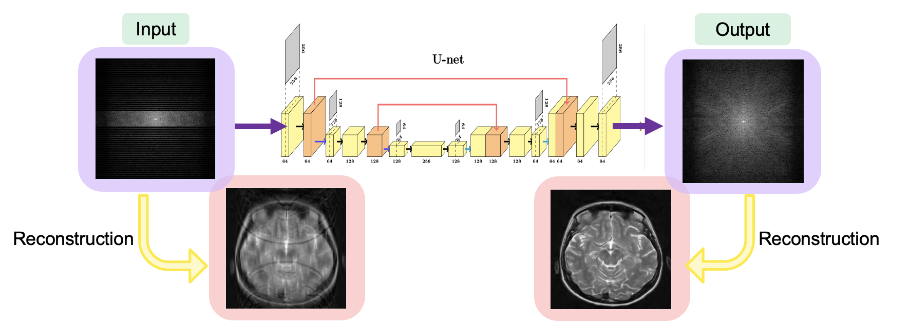
</p>

---
## Introduction

Hi!

This 1 month project was developed during the Brainhack School 2026 at Polytechnique Montréal.

---

## Overview

### Context

Respiratory motion during MRI acquisition introduces artifacts in k-space that degrade image quality. This is particularly critical for spinal cord imaging. This project aim to simulate breathing-induced motion corruption directly in k-space for accelerated MRI and trains a 2D U-Net to correct these artifacts.

Rather than working in image space, the model operates on **complex k-space data** (real + imaginary channels), which is more faithful to the actual acquisition process and allows correction before reconstruction.

### Main question

Can deep learning models correct breathing motion-induced artefact on accelerated MRI from corrupted k-space acquisitions ?

### Main objectives

The main objectives of my project were:
- Develop a simulation pipeline to generate corrupted k-space with respiratory motion, cartesian undersampling and gaussian noise
- Generate a training dataset by varying the motion (breathing-cycle) amplitude and frequency, the undersampling factor and the noise level
- Train a deep learning model for artifact correction in k-space
- Evaluate the model performance using quantitative image quality metrics

### Personal objectives

My personal objectives with this project were:
- Learn how deep-learning works
- Learn how to train a model
- Learn how to use high computational ressources
- Learn how to adapt a classical model (2D U-Net) on a specific project

### Pipeline Overview

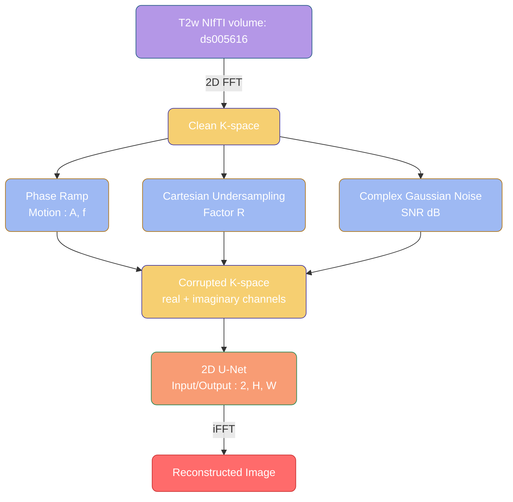

### Tools

To ensure that my project stays open and reproductible I use several tools that are widely use in neuroimaging MRI research:
- OpenNeuro, BIDS format and Datalab: Download only the necessary files of my dataset in a standardized way
- Python and jupyter notebooks: Implement my simulation, processing, and deep learning model training and evaluation pipelines
- Bash: Automate management of my datasets and access advanced computing resources
- Alliance of Canada: Train my deep learning model using high-performance (GPU-accelerated) computing
- GitHub: Document and share my project

### Deliverables

The main deliverable of this project is a fully documented GitHub repository containing all necessary files to:

- **Reproduce the full project:** from simulation to training to inference
- **Use the simulation pipeline only:** generate motion-corrupted k-space data for your own dataset
- **Use the pre-trained model directly:** run inference without retraining
- **Retrain the model:** on a different dataset or with different parameters

> See the **[Repository Structure](#repository-structure)** and **[Reproducibility Guide](#reproducibility-guide)** sections at the end of this README for a detailed description of the repository contents and how to reproduce any step of this project.

---

## Dataset

This project uses the **Whole-Spine Anatomical MRI dataset** (ds005616), available on:

- OpenNeuro: [https://openneuro.org/datasets/ds005616/versions/1.1.2](https://openneuro.org/datasets/ds005616/versions/1.1.2)
- GitHub: https://github.com/OpenNeuroDatasets/ds005616.git

For this project we use: 
- **Modality**: T2-weighted whole-spine MRI
- **Subjects**: 56
- **Resolution**: 1 mm³
- **Format**: NIfTI (.nii.gz), BIDS-compliant

<p align="center">
  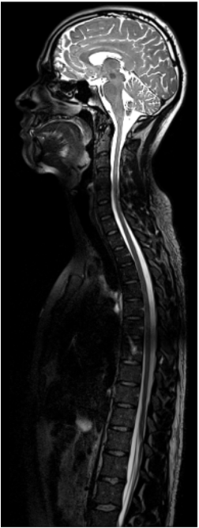
</p>

Data access via Datalad:
```bash
datalad install https://github.com/OpenNeuroDatasets/ds005616.git
datalad get sub-*/anat/sub-*_T2w.nii.gz
```
---

## K-space corruption simulation

During a gradient echo (GRE) MRI acquisition, k-space lines are acquired sequentially over time. Respiratory motion between acquisitions induces a **phase shift** in each k-space line, modeled as:

$$\tilde{K}(k_x, k_y) = K(k_x, k_y) \cdot e^{-j2\pi k_x \cdot d(k_y)}$$

where $d(k_y)$ is the respiratory displacement at the time of acquisition of line $k_y$. 

The animation below illustrates this process: the respiratory signal (top-left), the k-space being filled line by line with the resulting phase ramp (bottom-left), and the reconstructed image showing motion ghosting artifacts (right).

<p align="center">
  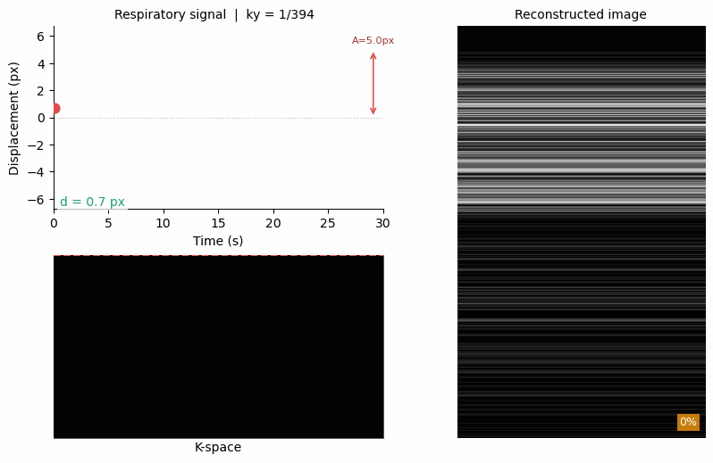
</p>

Combined with **Cartesian undersampling** (acceleration factor R) and **Gaussian noise**, this produces realistic corrupted k-space data that impose several typical artifacts on the reconstruted image.

<p align="center">
  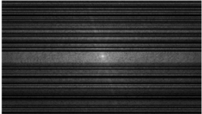
</p>

⚠️ Note: More detailled information about the simulation process are provided inside the Kspace_corruption_simulation.ipynb notebook.
See [`notebooks/Kspace_corruption_simulation_vf.ipynb`](notebooks/Kspace_corruption_simulation_vf.ipynb).

## Deep learning model

### Trainning dataset

A training dataset was generated my varying the corruption paramters: 

| Parameter | Range | Description |
|---|---|---|
| A | 2.0, 5.0, 8.0 px | Motion amplitude |
| f | 12, 15, 18 breaths/min | Respiratory rate |
| R | 2, 4, 6 | Undersampling factor |
| SNR | 15, 20, 25 dB | Signal-to-noise ratio |

Total combinations: **81 per slice** → 231,417 training samples across 56 subjects.

Choice of simulation parameters:

- **Motion amplitude A:** The motion amplitude A (in pixels, assuming 1 mm isotropic resolution) spans the physiological range of respiratory spinal cord displacement measured in vivo. Studies have shown that breathing induces spinal cord displacements of up to 10 mm in the anterior-posterior direction at 3T. At 1 mm/px resolution (ds005616), this translates to A = 1–10 px. We choose to use 2, 5 et 8 px displacement to cover a large range of displacement, 8px being already an important displacement, we choose to not done the 10px being rare et intense above all that the displacement here are applied to all the image. 

> *Verma, T. and Cohen-Adad, J. (2014). Effect of respiration on the B0 field in the human spinal cord at 3T. Magnetic Resonance in Medicine, 72: 1629–1636. https://doi.org/10.1002/mrm.25075*

- **Respiratory rate f:** The normal respiratory rate for adults at rest ranges from 12 to 20 breaths/min. We use f = 12, 15, 18 breaths/min to cover this physiological range.

> *Sapra A, Malik A, Bhandari P. Vital Sign Assessment. [Updated 2023 May 1]. In: StatPearls [Internet]. Treasure Island (FL): StatPearls Publishing; 2026 Jan-. Available from: https://www.ncbi.nlm.nih.gov/books/NBK553213/*

- **Undersampling factor R:** R = 2, 4, 6 corresponds to acquiring around 50%, 25% and 17% of k-space lines respectively, covering the typical acceleration factors used in clinical accelerated MRI protocols.

- **Signal-to-noise ratio SNR:** We simulate SNR values of 15, 20 and 25 dB. An SNR above 20 dB is generally considered sufficient for diagnostic image quality.

> *McRobbie, D.W., Moore, E.A., Graves, M.J., Prince, M.R. (2017). MRI from Picture to Proton. Cambridge University Press. — "As a rule-of-thumb an SNR higher than 20:1 offers little image quality advantage to the observer"*


### Model Architecture

**2D U-Net** with 3 pooling levels:

```
Input (2, H, W) — real & imaginary corrupted k-space
    │
    ├── Encoder: 32 → 64 → 128 → 256 (bottleneck)
    │   MaxPool2d between levels
    │
    ├── Decoder: 256 → 128 → 64 → 32
    │   ConvTranspose2d + skip connections
    │
Output (2, H, W) — real & imaginary corrected k-space
```

Parameters:
- Parameters: ~1.9M
- Optimizer: Adam (lr=1e-3)
- Scheduler: CosineAnnealingLR (T_max=20, eta_min=1e-6)
- Loss:  L1 (masked to valid region)

### Model trainning

Training was performed on **Alliance Canada (Narval)** using the SLURM job scheduler:
- GPU: 1× NVIDIA A100 (40 GB)
- CPUs: 8
- RAM: 32 GB
- time=36:00:00
- Epochs: 20
- Batch size: 32
- Framework: PyTorch 2.6

Script arguments:
- `--data_root`: Absolute path to the project root
- `--manifest`: Path to the dataset manifest CSV
- `--splits`: Path to the train/val/test split JSON
- `--output`: Output directory for checkpoints and history
- `--epochs`: Number of training epochs
- `--batch_size`: Batch size

---
## Results 

### Model evaluation

The train and loss curves shonx there where no overfiiting during training:
<p align="center">
  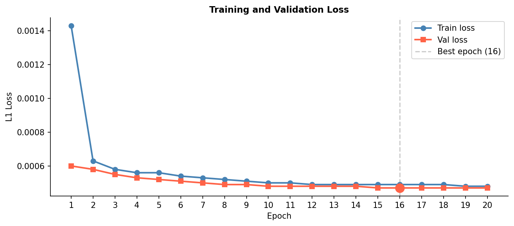
</p>

The quantitative images quality metrics SSIM et PSNR shown that the model was learning epoch by epoch:
<p align="center">
  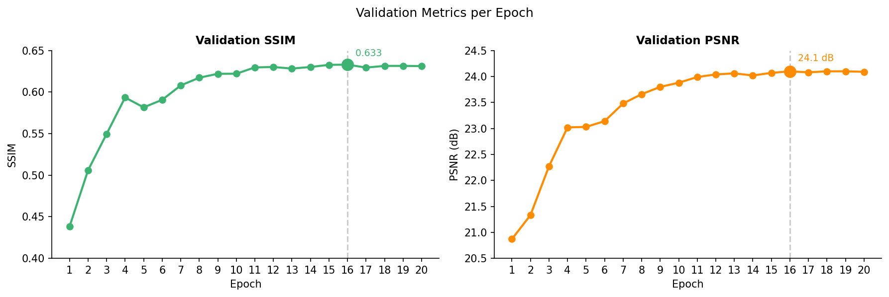
</p>

We observe great improvement:
- SSIM improved from 0.38 → 0.63 
- PSNR improved from 20.9 → 24.1 dB

### Model inference

#### Artifacts correction

The following figure shows the predicted k-space alongside the ground truth and the corrupted k-space:

<p align="center">
  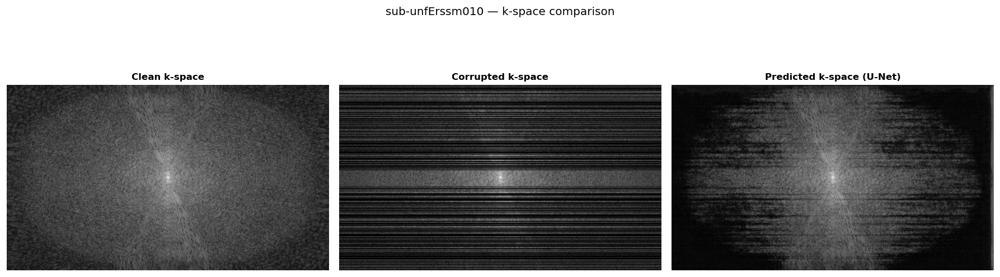
</p>

After reconstruction, the corrected image predicted by the model shows a clear reduction of motion ghosting artifacts compared to the corrupted input:

<p align="center">
  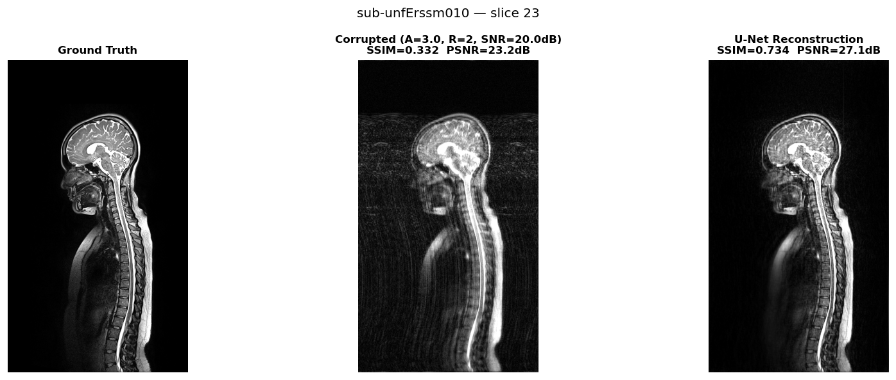
</p>

#### Motion severity comparison

The following figure shows the model's correction across different motion amplitudes (A = 2, 5, 8 px) to assess its robustness to varying artifact severity. The three corrected images all shows a clear reduction of the motion artifacts:

<p align="center">
  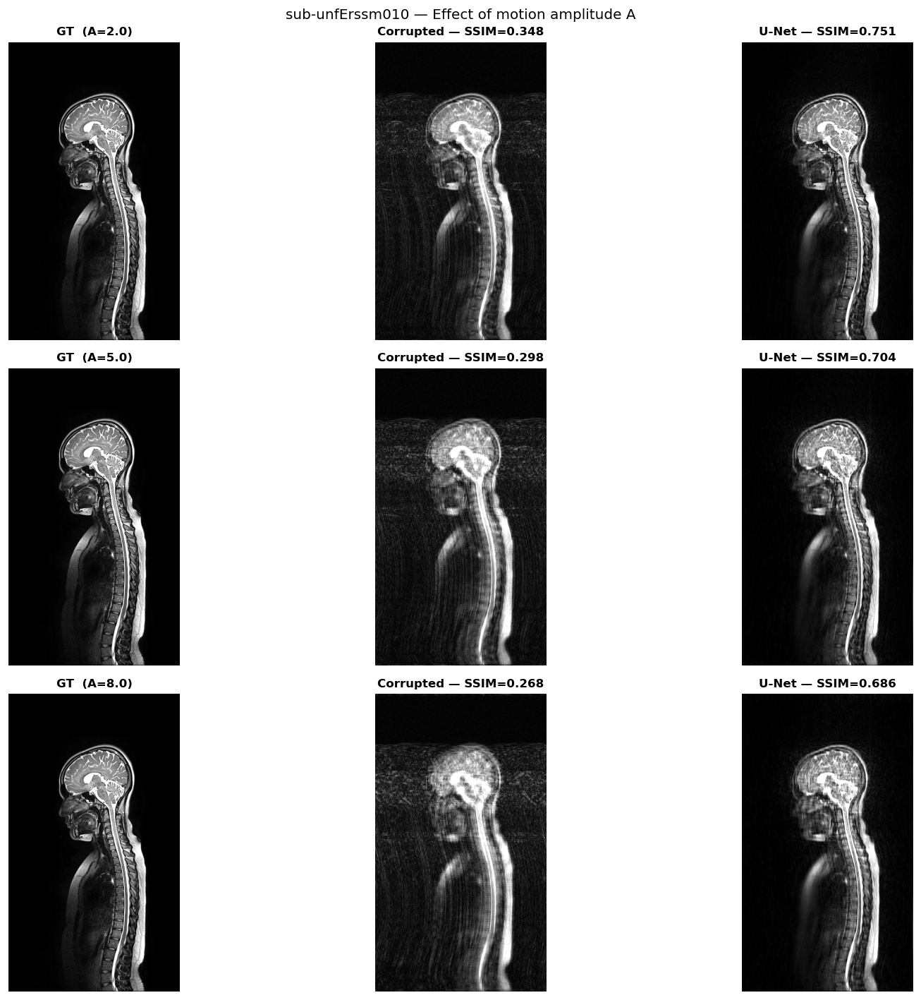
</p>

#### Artifacts correction on axial slices

Finally, you can see the correction on axial views. The results are particularly interresting because the spinal cord which had almost disappeared in the corrupted axial slices due to ghosting artifacts is successfully retrieved after model correction:

<p align="center">
  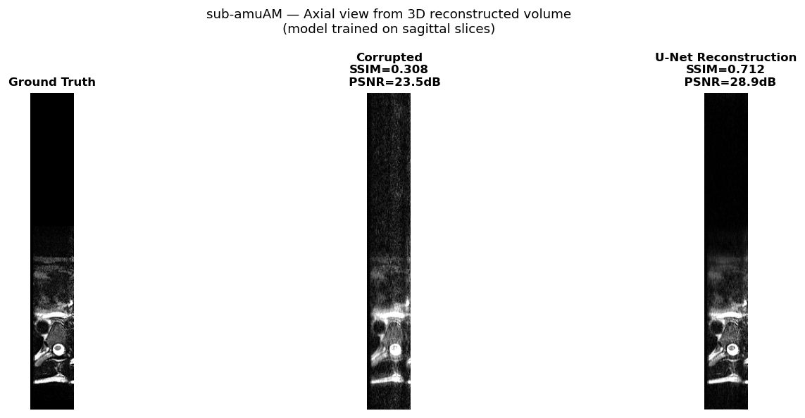
</p>

### Limitations

> **Note:** This project was primarily a learning experience in training and applying deep learning to a specific MRI reconstruction problem. The following limitations reflect the simplified assumptions made in the simulation model.

- **1D rigid motion only:** the model simulates translation along the readout direction only, without rotation or non-rigid deformation
- **Uniform displacement along the spine:** in reality, respiratory motion decreases with distance from the lungs; the cervical spine moves less than the thoracic spine
- **No B0 field fluctuations:** breathing also induced magnetic field inhomogeneities, which introduces additional  spatially and time-dependent phase errors in k-space not captured here
- **Simulated data only:** the model was trained and evaluated exclusively on simulated artifacts; validation on real motion-corrupted acquisitions remains to be done

---
## Repository Structure

```
Sarrazin_project/
│
├── src/
│   ├── Kspace_simulation.py           # K-space corruption pipeline
│   ├── Utils.py                       # Metrics and utilities
│   ├── Unet_model.py                  # 2D U-Net architecture
│   └── Unet_train.py                  # Training loop
│
├── notebooks/
│   ├── Kspace_corruption_simulan_vf.ipynb   # Step-by-step simulation
│   ├── Unet_inference.ipynb                    # Inference & visualization
│   ├── Unet_analysis.ipynb                   Training curves & metrics
│	└── Kspace_gif.ipynb 				# Breathing motion simulation gif
│
├── training_data/
│   ├── manifest.csv                # Dataset manifest (path, TR, TE, H, W, params)
│   └── splits.json                    # Train/val/test subject splits (70/15/15)
│
├── results/
│  ├── unet_best.pt               # Best model
│  ├── training_history.csv       # Metrics per epoch
│
├── README_figures/ 			#  Figures and images displayed in this README.
│
├── train_full.sh                      # SLURM job script (Alliance Canada)
├── requirements.txt 				   # Configuration file
└── README.md
```
Additional information:

- manifest.csv: one row per (subject × slice × corruption combo) with image path, acquisition parameters (TR, TE), original dimensions (H, W), and corruption parameters (A, f, R, SNR).
- splits.json: Reproducible subject split: 70% train / 15% val / 15% test fixed at random seed 42 -> ensures no data leakage between sets.

---
## Reproducibility Guide 

### Installation & Training

The following set-up use the server Narval on Alliance Canada, you can change it to the server name who want to use

### 1. Clone the repository

```bash
git clone https://github.com/annaellesarrazin/Sarrazin_project.git
cd Sarrazin_project
```

### 2. Set up the environment

```bash
conda create -n brainhack python=3.10
conda activate brainhack
pip install -r requirements.txt
```

### 3. Download the dataset

```bash
datalad install https://github.com/OpenNeuroDatasets/ds005616.git
cd ds005616
datalad get sub-*/anat/sub-*_T2w.nii.gz
cd ..
```

### 4. Transfer data to Alliance Canada (Narval)

```bash
rsync -av --progress \
    /path/to/Sarrazin_project/ \
    username@narval.alliancecan.ca:/scratch/username/Sarrazin_project/
```

### 5. Set up the environment on Narval

```bash
# Connect to Narval
ssh username@narval.alliancecan.ca

# Load Python module
module load python/3.10

# Create virtual environment
virtualenv ~/brainhack/brainhack
source ~/brainhack/brainhack/bin/activate

# Install dependencies
pip install torch torchvision
pip install -r requirements.txt
```

### 5. Train on Narval

```bash
# Connect to Narval
ssh username@narval.alliancecan.ca

# Go to the folder Sarrazin_project
cd /scratch/username/Sarrazin_project

# Submit the job — environment activation is handled by train_full.sh
sbatch train_full.sh

# Monitor training
squeue -u $USER          # check job status
tail -f logs/unet_*.out  # follow live logs
```

### 6. Retrieve results

```bash
# From your local machine
scp username@narval.alliancecan.ca:/scratch/username/Sarrazin_project/results/full_run/{unet_best.pt,training_history.csv} \
    results/
```

### 7. Inference & visualization

Open `notebooks/Unet_inference.ipynb` and set:

```python
MODEL_PATH  = Path('results/unet_best.pt')
SPLITS_PATH = Path('training_data/splits.json')
```

### 8. Analyze training

Open `notebooks/Unet_analysis.ipynb` and set:

```python
HISTORY_PATH = Path('results/training_history.csv')
```
---
## Conclusion

Deep learning seems promissing to effectively correct breathing-induced motion artifacts in accelerated MRI k-space.

On a personal level, this project was a great opportunity to learn how works deep learning, and how to train and evaluate a deep learning model for a specific problem. I enjoyed understanding the connections between MRI physics, k-space signal processing, and deep learning. I am looking forward to continue this work in the futur.

---
## References 🚨
- Vannesjo, S. J., Miller, K. L., Clare, S., & Tracey, I. (2018). _Spatiotemporal characterization of breathing-induced B0 field fluctuations in the cervical spinal cord at 7T_. NeuroImage, 167, 191–202. https://doi.org/10.1016/j.neuroimage.2017.11.031
- Makowski, D., Pham, T., Lau, Z.J., et al. (2021). _NeuroKit2: A Python Toolbox for Neurophysiological Signal Processing_. Behavior Research Methods. https://doi.org/10.3758/s13428-020-01516-y
- Verma, T. and Cohen-Adad, J. (2014). _Effect of respiration on the B0 field in the human spinal cord at 3T_. Magnetic Resonance in Medicine, 72: 1629–1636. https://doi.org/10.1002/mrm.25075
- Sapra A, Malik A, Bhandari P. Vital Sign Assessment. StatPearls (internet). Treasure Island (FL): StatPearls Publishing; 2026 Jan-. Available from: https://www.ncbi.nlm.nih.gov/books/NBK553213/
- McRobbie, D.W., Moore, E.A., Graves, M.J., Prince, M.R. (2017). _MRI from Picture to Proton_. Cambridge University Press (digital acces). Available from: https://www.cambridge.org/core/books/mri-from-picture-to-proton/3ADC814FF8FC6A78A54D37746F806D5A
- Kastryulin, S., Zakirov, J., Pezzotti, N., & Dylov, D. V. (2022). Image quality assessment for magnetic resonance imaging. Philips Research; Skolkovo Institute of Science and Technology; Eindhoven University of Technology. https://arxiv.org/abs/2203.07809
  
---
## Author

<a href="https://github.com/Annaelle8">
  
  <br /><sub><b>Annaelle8</b></sub>
</a>

**Annaelle Sarrazin** — Brainhack School 2026


